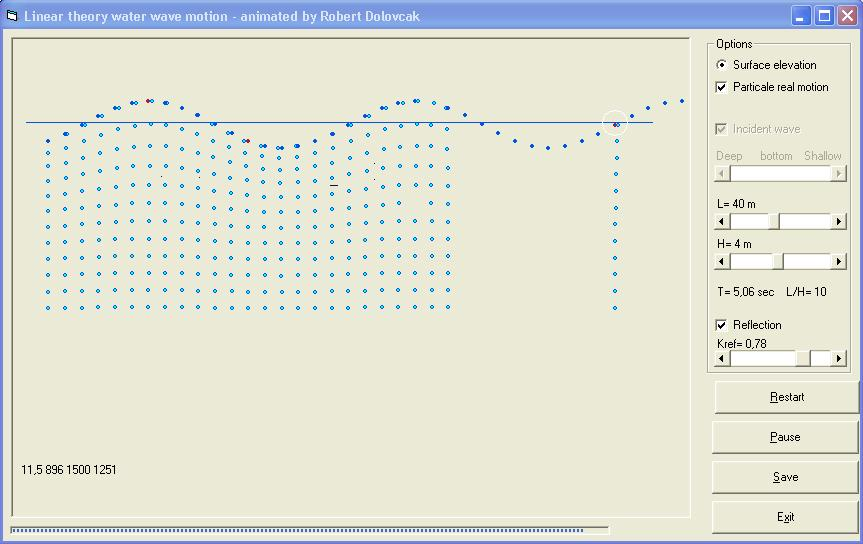



## Sea waves animation

### Description

Shows a 1D wave pool made of single incident and single reflected sea wave (linear theory). Shows surface elevation of sea surface and animate the motion of particles from surface indept.Surface elevetion is recorded at red dots positions (level gauges).
 
### More Info
 
This code provide records like one obtained from 1-D wave generator, wich are collected by level gauges. This is first step in future spectral analysis (DFT) project. With known Input wave parameters(L,H,T and Kref) it is easier to check if spectral analysis is workin ok..

Graphic animation of water wave motion.

             |
---                |---
**Submitted On**   |2005-03-01 14:57:54
**By**             |[Dolac](https://github.com/Planet-Source-Code/PSCIndex/blob/master/ByAuthor/dolac.md)
**Level**          |Intermediate
**User Rating**    |5.0 (10 globes from 2 users)
**Compatibility**  |VB 5\.0, VB 6\.0
**Category**       |[Math/ Dates](https://github.com/Planet-Source-Code/PSCIndex/blob/master/ByCategory/math-dates__1-37.md)
**World**          |[Visual Basic](https://github.com/Planet-Source-Code/PSCIndex/blob/master/ByWorld/visual-basic.md)
**Archive File**   |[Sea\_waves\_2172421102010\.zip](https://github.com/Planet-Source-Code/dolac-sea-waves-animation__1-72824/archive/master.zip)

